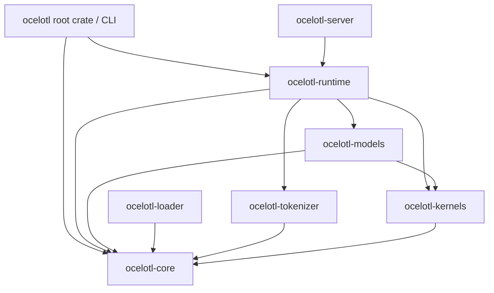
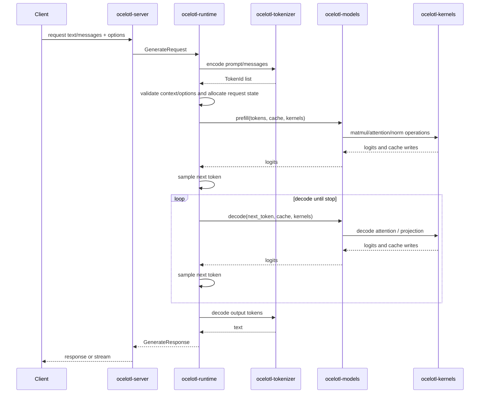
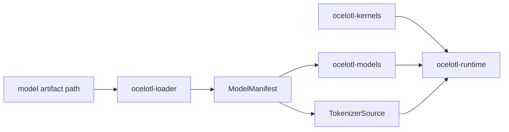

# Architecture

Ocelotl is a Rust-first LLM inference runtime with explicit boundaries between
artifact loading, tokenization, model semantics, kernel dispatch, request
lifecycle, and transport APIs.

The architecture is intentionally staged. Early milestones optimize for
correctness and testability, not throughput.

## Crate Dependency Direction

Crates should depend inward on contracts, not sideways on implementation details.



Rules:

- `ocelotl-core` does not depend on implementation crates.
- `ocelotl-loader` does not depend on runtime or models.
- `ocelotl-server` does not depend on loader, models, or kernels directly.
- `ocelotl-runtime` coordinates model, tokenizer, and kernel contracts.
- External libraries stay inside the crate that owns their responsibility.

## Request Data Flow

A generation request should move through the system like this:



The loader is not shown in the hot request path because model loading should be a
setup step. Runtime construction may use `ocelotl-loader` to open artifacts and
`ocelotl-tokenizer` to construct tokenizer instances, but request handling should
not parse model files.

## Load-Time Flow



Load-time validation should reject unsupported model features before the runtime
can accept requests.

## Ownership Boundaries

Loader owns:

- File format detection.
- Artifact metadata validation.
- Verified tensor access.

Tokenizer owns:

- Token IDs.
- Encode/decode behavior.
- Chat-template rendering behavior.

Models own:

- Architecture-specific forward semantics.
- Model-specific validation.
- Calls into kernel traits.

Kernels own:

- Backend-specific compute implementation.
- Shape/dtype/layout validation at launch boundaries.
- CPU/GPU parity surfaces.

Runtime owns:

- Request lifecycle.
- KV cache ownership.
- Prefill/decode orchestration.
- Sampling.
- Cancellation and cleanup.
- Scheduling once M7 begins.

Server owns:

- Transport parsing.
- Public error mapping.
- Streaming protocol behavior.
- Runtime handle wiring.

## M1 Architecture Slice

M1 should implement the smallest vertical path:

```text
GenerateRequest
  -> runtime validation
  -> synthetic or fixture tokenizer path
  -> one CPU reference model path
  -> one-token prefill/decode fixture
  -> GenerateResponse
```

M1 should not introduce GPU, paged KV, real server APIs, broad loaders, or
scheduler behavior.

## Architecture Guardrails

- No crate should become a catch-all for convenience.
- No external library type should leak into public runtime/server APIs without a
  deliberate design decision.
- No unsupported model feature should silently fall back to a weaker path.
- No GPU path should become default without CPU parity.
- No scheduler should be added before single-request resource ownership is
  correct.

## Related Docs

- `docs/crate-boundaries.md`
- `docs/design/interfaces.md`
- `docs/design/errors.md`
- `docs/design/runtime.md`
- `docs/design/kv-cache.md`
- `docs/validation/tdd.md`
